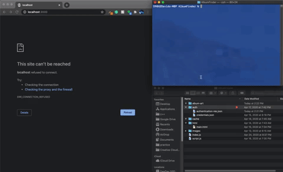

# Album-Art-Finder
Requests artist info using Spotify API and requests all the artist's album cover images and outputs them on a page. Before requesting api, the program checks the authentication-res.json to see if the latest key is expired and if so it generates a new one and updates the json file with it. The program also checks the albums folder before requesting to download them to see if they have been downloaded before, if so it skips that and just outputs that image from the album directory.  

To use the program: 
- clone it on your local machine 
- *IMPORTANT* Go on Spotify.com and create a developer account, get you clientID and clientSecret and add them in the script.js file
- open your terminal and navigate to the project directory
- run “node index.js”
- open your preferred browser and go to http://localhost:3000 

